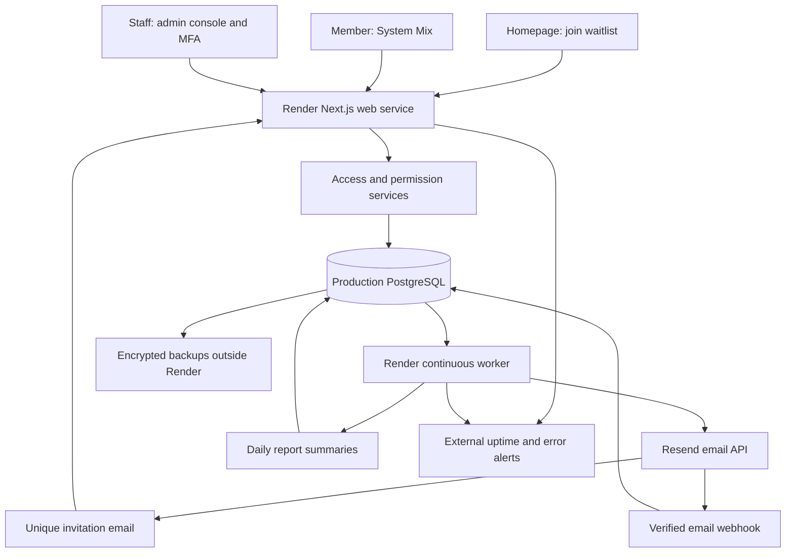

# Waitlist, referrals, and live administration plan

**Date:** September 8, 2026  
**Status:** Implementation plan, not a deployment receipt. This document replaces the earlier referral-only/no-waitlist decision. No new access flow, admin permissions, paid services, or public release is activated by this plan.

## 1. Product rules

The homepage offers **Join the waitlist**. Joining records interest, verifies the email, and does not create an application account. The worker releases up to 10 verified entries every 7 days: 5 FIFO by original request time, then 5 random from the remaining verified queue. Administrators can also release selected confirmed entries manually, separately from the weekly ten. Existing members can also invite contacts through the **Jump in the Mix System Mix**. Either path grants a free account through a unique URL bound to one email.

Each verified member receives five lifetime personal invitations. Wave invitations come from the platform and never spend an administrator's five personal slots. Members create and send personal invitations only within the System Mix; no general-purpose shareable referral code is introduced.

**Automatic waitlist removal:** when either path issues an active access grant, the matching email disappears from the default **Waiting** queue immediately. Retain an **Access granted** history entry with source, wave/referrer, delivery status, and eventual account ID. This is a status transition, not deletion of the audit trail. Account creation changes that history entry to **Joined**. Delivery problems belong in **Needs attention**, not back in the next wave silently.

Implemented September 8: email-only public form with confirmation; automatic 7-day waves of up to 10 (5 FIFO + 5 random); additional manual selections; email delivery; single-use email-bound links valid until used or revoked. The first wave is seven days after the configured worker first runs. [Waitlist operation](WAITLIST_OPERATIONS.md) describes the implemented subset and remaining launch work; broader sections below remain the target architecture.

## 2. What exists and what must be built

| Area | Repository foundation | Planned extension |
| --- | --- | --- |
| Public entry | Homepage waitlist, confirmation, duplicate handling, withdrawal/confirmed rejoining, invitation URL signup | Retention automation and live qualification |
| Member referrals | Five-slot counter, recipient-bound URLs, System Mix, revocation, shared admission lock, waitlist synchronization and durable frozen outbox | Provider-qualified recovery |
| Admin home | Totals for users, contacts, mixes, jobs, support | Prioritized action queue, wave controls, service status, growth and retention |
| Users/support | Account search/filter/pagination, suspension/restoration, session revocation, assigned support tickets, case/session-bound read-only views and sensitive-read audit | Typed customer-approved repairs and recovery workflows |
| Mixes | Library and System Mix drafts, saved previews, immutable versions, publication/rollback and impact counts | Live qualification |
| Admin authorization | Named staff memberships, roles, individual grants/denials, MFA, owner bootstrap, staff email onboarding, immediate revocation and last-Owner protection | Unusual-access alerts and retention qualification |
| Audit | Separate platform audit for waves, staff, settings, access changes and verified email events | Field minimization, retention and broader sensitive-read coverage |
| Processing | PostgreSQL jobs, leases, bounded invitation retries, scheduled waves, verified provider receipts, reconciliation and worker heartbeat | Verified provider-record recovery and explicit repeat delivery with archived generations implemented; production qualification remains |
| Operations | Health routes, job retry UI, backup/restore tools, email budgets/reserves and diagnostics | Alerts, remaining incident controls, restore drills, live release checklist |

Evidence: `src/components/AdminNav.tsx`, `src/lib/auth.ts`, `src/lib/referral-access.ts`, `src/lib/system-mix-actions.ts`, `src/worker/index.ts`, `prisma/schema.prisma`, and the current admin routes. Local database/browser evidence now covers the waitlist, wave, permissions, shared outbox and email controls. See [the completion ledger](PRODUCT_COMPLETION.md) for exact receipts and the remaining launch gates.

## 3. Infrastructure at launch

Use the existing Next.js application and PostgreSQL queue. The admin console shares the deployment and database, with its own authorization boundary. No separate admin server, Redis cluster, analytics warehouse, paid waitlist tool, or native mobile client is required initially.

| Resource | Initial choice | Responsibility |
| --- | --- | --- |
| Domain | Existing Route 53 zone and registration | Canonical domain, DNS, mail verification records |
| Web | Small paid Render web instance | Homepage, app, admin, authenticated actions, webhooks |
| Worker | Small paid continuous Render worker | Follow-ups, access emails, reports, retention, reconciliation |
| Database | Separate paid Render PostgreSQL, same region | Customer data, waitlist, permissions, queue, access grants |
| Email | Resend free tier while quotas permit | Confirmation, access, verification, recovery, support notifications |
| Support | Existing monitored mailbox if available | Customer replies and incident contact |
| Backups | Separate encrypted object storage | Daily exports, pre-migration backups, recovery copies |
| Monitoring | External uptime checks plus a small error-reporting allowance | Web, database readiness, worker, email and queue alerts |
| Test | Existing isolated test site/database plus a Render rehearsal | Synthetic data, isolated credentials, release validation |

The existing launch estimate is approximately **$22/month in core Render services, sample database storage, and DNS**, before mailbox, independent backup storage, overages, taxes, domain renewal, and test services. Waitlist and admin features use these same services. This is a starting budget, not a capacity guarantee. See [the launch plan](PRODUCTION_LAUNCH_PLAN.md) and [Render pricing](https://render.com/pricing).

Free Render web hosting is for an explicitly limited rehearsal: it sleeps after 15 idle minutes and may take about a minute to resume. Free PostgreSQL expires after 30 days and has no backups; use paid storage for lasting customer data. The continuous worker has no free tier. [Render free-tier limits](https://render.com/docs/free)

Separate web/worker runtime database users from the migration/restore user. Runtime roles receive only required data privileges; migration credentials stay in the release environment. Provider API keys, encryption keys, and infrastructure access belong in secret management, never editable plaintext admin fields. Application admin permissions do not confer Render, AWS, GitHub, or Resend console access; manage named provider accounts separately with MFA.

## 4. Waitlist and access lifecycle

### Public entry

Homepage primary CTA: **Join the waitlist**. Explain that access is released in waves and an existing member can invite a contact sooner, subject to available capacity. Keep **Sign in** and the product demo available. The referral URL opens its own signup flow; it does not ask the recipient to join the waitlist first.

Normalize email exactly as authentication does: trim and lowercase. Do not strip plus tags or Gmail dots. Use a unique normalized-email identity shared by waitlist and access records. Repeated submissions preserve the original queue timestamp and operator decisions. Show the same public receipt for duplicate, already-invited, and existing-account submissions; do not reveal account membership.

Email confirmation is required for wave eligibility. Add IP/email rate limits, a honeypot, request size limits, and an adaptive bot challenge if abuse warrants one. Confirmation and withdrawal tokens are hashed, scoped, expiring, and one-use. The implemented public withdrawal flow explicitly combines leaving the waitlist with stopping all access-invitation emails and revoking unused grants. Rejoining requires new email proof and resets queue position. Hard-bounce/complaint suppression is separate and cannot be removed by rejoining. A person's request for access is not blanket marketing consent.

### State and queue definitions

| Admin view | Meaning | Next action |
| --- | --- | --- |
| Unconfirmed | Waitlist form submitted; email not verified | Confirm email or expire under retention policy |
| Waiting | Verified interest; no active grant/account; not suppressed | Eligible for a wave |
| Access granted | Unique active grant exists, from wave or referral | Track queued/sent/delivery issue/expiry |
| Joined | Grant was claimed and account created | Track email verification and activation |
| Needs attention | Bounce, failed/uncertain send, expiry, or conflict | Resolve, reissue, revoke, or explicitly return to Waiting |
| Withdrawn / Suppressed | Unsubscribed or operator/provider block | Excluded from waves and automated retries |

A referral to an email in Waiting or Unconfirmed immediately removes it from the active queue when the grant is committed. Waitlist confirmation is not required for a personal referral, but the new account still must verify its email. A referral that fails before grant creation leaves the waitlist alone. Failure after grant creation keeps the email out of Waiting and shows a delivery task instead.

### One email, one access decision

Use a shared `AccessIdentity` row, keyed uniquely by normalized email, as the concurrency boundary for both paths. In one PostgreSQL transaction:

1. Lock that identity; check account existence, suppression, launch capacity, and existing grants.
2. Reuse an existing valid grant or skip creation. A repeated referral must not spend a second personal slot. Do not disclose whether the recipient was on the waitlist to the member.
3. For a new member referral, conditionally reserve one of that sender's five lifetime slots. For a wave, reserve a platform admission, never a member slot.
4. Create the email-bound grant, attribution, and delivery outbox record; transition the waitlist row to Access granted; skip/cancel competing unsent wave entries and obsolete waitlist confirmation/reminder emails.
5. Commit together. The worker sends only committed outbox items.

The first valid grant wins attribution. If a wave draft includes an email that receives a referral, skip that wave entry on release. If the wave already granted access, a later referral does not issue another URL or spend a personal slot. Never invalidate a delivered grant merely to change its attribution. One account cannot claim two invitations. Database uniqueness and conditional updates enforce this, not UI counters.

A unique URL is consumed only by successful account creation in the same transaction as referral attribution. GET, email scanners, preview bots, and failed signup attempts do not consume it. Different emails cannot redeem it. Already-used links offer sign-in and recovery guidance. Email changes require verified ownership of the new address and do not refresh the five-slot allowance.

## 5. Releasing waitlist waves

Admin workflow: **filter → select → preview → release/schedule → monitor**.

A wave has a name, fixed candidate snapshot, creator, release authority, UTC schedule shown in the operator's timezone, batch size, pacing, expiry, and status. Start with oldest verified requests; permit explicit filters such as use case, signup date, or manually assigned tags. A preview shows eligible, duplicate, already-granted, suppressed, and excluded counts, expected emails, seat capacity, and the exact version of the message.

Proposed lifecycle: `DRAFT → SCHEDULED → RELEASING → COMPLETE`, with `PAUSED`, `CANCELED`, and `NEEDS_ATTENTION`. Changing recipients or message version after approval returns the wave to Draft. Release requires a permission check and a fresh preview revision; stale browser tabs cannot release a changed wave.

Process small batches with durable per-recipient entries. Recheck eligibility before every grant. A crash/retry resumes the same entries instead of sending the wave again. Pause stops future grants/sends; it does not recall email already sent. Cancel closes unsent entries. Delivered invitations remain valid unless a separately authorized revocation is recorded.

Reserve capacity for each active unused grant so an invited person has room to join. The capacity ceiling counts accounts plus outstanding reservations. Expired/revoked grants release capacity; they do not restore a sender's personal quota. The implemented limits default to zero until an authorized administrator configures them; existing grants remain usable. Begin with a conservative owner-set ceiling and increase it with measured performance. Five invitations per member alone does not cap total growth: 20 founding accounts could invite 100 people in the next generation, who could invite more.

Provide separate switches for waitlist collection, wave releases, member invite issuance, and new account redemption. Pausing issuance normally honors already-issued grants. An emergency redemption pause preserves the grant and offers a retry message. Routine admin users cannot silently change the five-invite product rule; a future allowance change is an owner-approved product change with migration and tests.

## 6. Reliable email delivery

Extend the existing PostgreSQL worker with access-delivery, wave-dispatch, reconciliation, and report-summary tasks. Keep account recovery/verification ahead of growth mail and follow-up scheduling protected from large waves. Bound concurrency and batch size; use job leases and retry backoff.

A durable outbox is created with the business transaction. Store the approved message version and safe render inputs, encrypted access-token material, a delivery attempt ID, provider message ID, timestamps, and sanitized status. Keep URL secrets out of activity logs, reporting, admin payloads, error trackers, and request logs.

Resend idempotency keys last 24 hours; they do not establish permanent exactly-once sending. Maintain local delivery state and reuse the same attempt ID/payload for safe retries. An uncertain result outside the provider's deduplication window goes to reconciliation/manual review, not blind resend. A deliberate resend creates a new audited delivery attempt against the same grant, without another member slot. [Resend idempotency guidance](https://resend.com/docs/dashboard/emails/idempotency-keys)

Implemented locally: audited suppression review with preserved history and recipient opt-out, local and provider-verified acceptance recovery without another send, explicitly reviewed repeats of the same grant with preserved attempt history, and a signed webhook endpoint with raw-body verification and unique provider-event IDs; see [Email operations](EMAIL_OPERATIONS.md). Deduplicate deliveries and handle out-of-order events without changing Accepted back to Sent. A provider's API acceptance is not proof of inbox delivery. Separate queued, provider-accepted, delivered, bounced, complained, and failed states; suppress further access mail after permanent bounces/complaints. [Resend webhook behavior](https://resend.com/docs/webhooks/introduction)

Start on the free email plan if usage fits: it includes 3,000 emails/month and 100/day. Count waitlist confirmations, referrals, account verification, password recovery, and support email together. Implemented limits count all API attempts conservatively: 90 per rolling 24 hours and 2,700 per rolling 31 days, reserving 20/300 of those totals for account mail. Invitations wait when capacity is unavailable; synchronous sends fail safely. Optional summaries start off for new accounts. Provider-account usage outside this app is not included. A global account ceiling and outstanding-reservation limit are implemented locally; see [Admission controls](ADMISSION_CONTROLS.md). Proactive usage alerts remain to be implemented. No free-tier cap can guarantee unlimited password recovery; alert and upgrade before essential mail is constrained. [Resend pricing](https://resend.com/pricing)

## 7. Admin console structure

| Area | Operator experience | Priority |
| --- | --- | --- |
| Overview | Today's required actions, service health, waiting count, next wave, activation, email budget, failed deliveries | Launch |
| Waitlist | Search/filter, stable pagination, tags, confirmation state, safe CSV import/export, suppression and withdrawal | Launch; import can follow |
| Waves | Draft/preview/release/pause/cancel, candidate exclusions, progress and source attribution | Launch |
| Access and referrals | Grant lifecycle, sender/recipient attribution, five-slot usage, delivery status, revocation, abuse review | Launch |
| Users | Profile and account state, join source, email verification, last meaningful use, session revocation, suspension, recovery | Launch |
| Mixes | System Mix and curated library drafts, test previews, version history, publish/rollback, affected-user counts | Launch |
| Support | Assigned queues, priority, private replies, SLA targets, links to user and scoped support view | Extend existing at launch |
| Reports | Waitlist conversion, wave results, referral joins, activation, retention, mix effectiveness, error and cost trends | Core launch; advanced later |
| Operations | Web/DB/worker status, queue ages, safe job retry, email quota, backup freshness, deployment revision | Launch |
| Audit and logs | Searchable platform events, changes and reasons, correlation IDs, sanitized diagnostic links | Launch |
| Team and permissions | Invite/deactivate admins, roles, individual overrides, MFA status, effective-access preview | Before adding another admin |
| Settings | Reviewed launch controls, support identity, retention settings, notification thresholds | Launch |

Use one admin navigation and a separate staff layout; current routes duplicate navigation in some pages and inherit the customer workspace requirement. Move administration into a route group guarded by staff identity/MFA rather than requiring a fake customer workspace. Staff membership is distinct from customer ownership and from eligibility for personal invitations. A staff-only account does not consume a wave seat or receive member invitations unless separately admitted as a customer.

Make common work clear: default to items needing action, remember filters, show timezone and last-refresh time, provide empty states and linked next steps, and support keyboard navigation. Bulk changes show exact counts and impact before submission; long jobs display durable progress and partial failures. An inaccessible section disappears from navigation, while the server still denies direct requests. Never present a successful send, role change, or release before its durable result is known.

## 8. Admin permissions

Use role templates for convenience and named permissions for enforcement. Each named administrator has an individual membership, one primary role, optional explicit grants/denials, status, inviter, and permission revision. Denial overrides grant; absent permission means denied. Customer workspace membership never confers platform rights.

| Capability | Owner | Operations | Growth | Mix editor | Support | Analyst |
| --- | --- | --- | --- | --- | --- | --- |
| Aggregate reports | Full | Yes | Yes | Mix reports | Support reports | Yes |
| Waitlist PII / waves | Full | Status only | Manage/release | No | Lookup only with grant | Aggregates only |
| Access revocation | Yes | Yes | Wave grants only | No | No | No |
| Customer metadata | Yes | Limited | Acquisition fields | No | Yes | Aggregates only |
| Customer contact/message content | Separate scoped support permission | No | No | No | Only with explicit grant/reason | No |
| Account suspension/session revoke | Yes | Yes | No | No | Separate grant | No |
| Mix draft/edit | Yes | No | No | Yes | No | No |
| Mix publish/rollback | Yes | No | No | Separate publish grant | No | No |
| Operational logs/jobs | Yes | Yes | Wave delivery only | No | Relevant support status | Aggregates only |
| PII export/deletion execution | Separate sensitive-action permission | No | Separate waitlist export grant | No | Request only | No |
| Staff/roles/owner transfer | Owner only | No | No | No | No | No |
| Secret values or raw invitation URLs | Not shown | Not shown | Not shown | Not shown | Not shown | Not shown |

Initial permission families: `dashboard.read`, `reports.read`, `waitlist.read`, `waitlist.manage`, `waitlist.export`, `waves.draft`, `waves.release`, `waves.pause`, `access.read`, `access.revoke`, `users.read`, `users.suspend`, `sessions.revoke`, `support.manage`, `support.view_customer`, `mixes.edit`, `mixes.publish`, `operations.read`, `jobs.retry`, `audit.read`, `settings.manage`, `privacy.export`, `privacy.delete`, and `staff.manage`. Scope checks narrow broad permissions to allowed resources and data fields, including wave-only grants and the assigned support case.

Every page, data loader, Server Action, API route, export, and background operation performs authorization where it executes. Recheck authority at wave execution and job enqueue/execution; deactivating a scheduler must not leave their unreleased waves running by accident. Pause their future waves for owner reassignment. Keep request-local authorization memoization only; permission changes take effect on the next request and revoke active staff/support sessions. These choices follow least privilege, default denial, and per-request checks. [OWASP authorization guidance](https://cheatsheetseries.owasp.org/cheatsheets/Authorization_Cheat_Sheet.html)

Staff onboarding: Owner enters email and role/overrides → invitation to that email → verify identity → set credentials → enroll MFA → activate staff access. No shared administrator login, self-granted permissions, arbitrary-role form fields, or grants exceeding the acting owner's authority. Staff invitations are separate from customer access invitations. Preserve at least one active Owner; ownership transfer requires reauthentication and an audited explicit transfer. Bootstrap the first Owner through a controlled operator procedure. Convert existing `isPlatformAdmin` users from an explicit reviewed mapping; never turn every legacy admin into an Owner automatically.

Require MFA for all staff in production, with fresh reauthentication for role changes, bulk PII exports, deletion execution, large releases, and ownership transfer. Provide recovery procedures and revoke compromised sessions. Additional approval by another authorized person can be enabled for bulk destructive actions when there are two operators; initial solo operation must not depend on a nonexistent second admin. Recovery codes and infrastructure-owner recovery remain outside customer support tools.

## 9. Mix management and user data

Separate **System Mix content**, **curated library templates**, and **customer-owned mixes**. Editors can draft copy and timing where supported; they cannot alter authorization checks, recipient binding, invitation limits, or inject arbitrary HTML/JavaScript. Validate placeholders and preview mobile email, text, empty fields, and long names using synthetic contacts.

The library implements draft → preview/test → publish with immutable versions and an audit record; see [Library administration](LIBRARY_ADMINISTRATION.md). The separate [System Mix workflow](SYSTEM_MIX_ADMINISTRATION.md) now implements subject/introduction drafts, previews, publication, rollback and frozen invitation-version attribution. Publishing changes the active version for future work. Each queued invitation snapshots its version and render inputs, so a publish cannot mutate an in-flight idempotent request. Rolling back selects a previous approved version for future work. Updating existing customer mixes is a separate scoped operation with a diff, affected-contact/job counts, owner consent where appropriate, dry-run, and rollback. Do not silently overwrite customers' edited messages or turn on automatic sending.

User screens show operational metadata first. Keep contact notes, message bodies, private fields, authentication secrets, and session tokens out of overview/report/log payloads. Access to customer content now uses a timed, read-only support session bound to the originating staff sign-in and assigned active case, a written reason, an explicit permission, and per-request audit receipts. Reassignment and resolution end access; see [Support case access](SUPPORT_CASE_ACCESS.md). Resolve support issues through typed actions, not an arbitrary database editor or executable SQL box.

Customer suspension/restoration and session revocation are implemented locally with permission, password, recent-MFA and stale-revision checks; see [Account administration](USER_ADMINISTRATION.md). Verification recovery and export/deletion request workflows still need full operational qualification. Suspension blocks new logins and privileged mutations, pauses that user's outgoing grants/jobs as defined by policy, and preserves the account for review; it does not silently revoke already-independent referred accounts. An admin changes a customer's email only through a verified recovery procedure. Deletion removes relevant PII and queued mail, invalidates unused grants, and preserves only the documented minimal audit/tombstone data needed to avoid token reuse and enforce retention.

## 10. Proposed data model and migration boundaries

| Model | Purpose and key constraints |
| --- | --- |
| `AccessIdentity` | Unique normalized email; serialized access decision; current grant/account references; suppression state |
| `WaitlistEntry` | Unique identity; name/use case, confirmation, original signup time, state, attribution, withdrawal and retention timestamps |
| `AccessGrant` | Source `WAVE` or `MEMBER`, identity, hashed token and encrypted resend envelope, lifecycle, optional expiry, claim/account ID; at most one active grant per identity |
| `AccessWave` / `AccessWaveEntry` | Versioned release configuration and recipient snapshot; unique wave+identity; per-entry grant/result |
| `InviteAllocation` | Member lifetime slot ledger; unique member+slot number 1–5; original contact and grant; never automatically replenished |
| `EmailOutbox` / `EmailAttempt` | Durable send intent, message version, stable attempt key, lease/status, provider receipt, retry/reconciliation state |
| `ProviderEvent` | Unique provider event ID; signature-verified receipt, minimal payload, processed status |
| `StaffMembership` / `StaffInvitation` | Named staff lifecycle, role, MFA activation requirements, invitation token hash/expiry |
| `AdminRole` / `AdminPermissionOverride` | Reviewed role permissions and per-person grant/deny with revision, actor, and reason |
| `PlatformAuditEvent` | Append-only actor/action/target/outcome/reason/correlation ID, sanitized before/after; optional workspace |
| `MixRelease` | Immutable System Mix/library version, draft/published status, schema-validated content and release metadata |
| `DailyMetric` | Small aggregate reports by date/source/wave/version; unique dimension key; recomputable |

Keep existing `User`, workspaces, contact ownership, support conversations, jobs, and authentication tokens. Consolidate current `ReferralAccessInvite` into shared grants without changing live URLs or resetting the current five-slot count. If any invitations are live at migration time, backfill their attribution, delivery state, and slot ledger and verify row counts/checksums before switching reads. Add database constraints for source-specific required fields, token uniqueness, recipient matching, active grant uniqueness, and slot limits.

Introduce tables and permissions first, backfill, compare old/new decisions, then enforce the new route guards and shared access service. Use a short issuance maintenance window for the final switch if dual-writing would create risk. Never run both old and new independent quota authorities. Do not enable waves until referral/wave races pass against real PostgreSQL. Use forward-compatible migrations, coordinated web/worker releases, and a tested rollback that keeps the newer data intact.

## 11. Reports, logs, and operational controls

Live aggregate reports, persisted daily summaries, observed database-size history and asynchronous expiring exports are implemented at `/admin/reports`; see [Report definitions and limits](ADMIN_REPORTS.md). Independent allowance/health alerts are implemented locally; see [Operational alerts](OPERATIONAL_ALERTS.md). Historical referral eligibility denominators and external hosting usage remain planned. Saved reports carry their calculation time and definition; they do not claim immutable historical totals.

Core reports: confirmed waiting count and age; wave queued/sent/delivered/joined/activated totals; referral-issued and referral-joined counts; unique inviting members; first useful follow-up completion; 7-day and 30-day retention; active accounts; queue age and failures; email budget; database growth and hosting usage. Define activation as completing setup and a meaningful follow-up action, not merely a page load. Define retention using meaningful authenticated use; exclude staff support sessions, tests, bots, and health probes.

Attribute each joined account to exactly one grant source. Show issued, joined, and activated separately; do not claim invitation sends or email opens are successful referrals. Report verified referral joins per eligible member/cohort and time-to-join without implying guaranteed viral growth. Start with indexed PostgreSQL queries and daily rollups. Permission-gated exports are asynchronous, bounded, audited, protected against CSV formula injection, and delivered through expiring authenticated downloads. No contact/message contents in general analytics.

Platform auditing must work even without a customer workspace. The current workspace-cascading audit table is insufficient for staff changes and waves. Use append-only application access and a separate maintenance role/retention job; customer deletion must not erase staff accountability indiscriminately. Record denials and sensitive reads as well as mutations. Show sanitized error summaries with correlation IDs; raw stack traces and provider payloads stay restricted and scrubbed.

Provisional operations targets: worker heartbeat warning at the existing 90-second threshold; alert on sustained job-age growth, repeated mail failures, all-service outages, failed backups, and unexpected cost growth. Set baselines during rehearsal instead of inventing a guaranteed user capacity. Route critical alerts to a monitored operator mailbox and a second recovery contact. Each alert links to a concise investigation/retry/rollback runbook.

Global controls: pause new grants, pause a wave, pause member issuance, stop a problematic mix version, suspend an abusive account, retry a known-safe job, and emergency redemption pause. Restrict these by permission; show scope, impact, reason, and expiry where applicable. Resuming work reconciles durable state rather than replaying everything.

## 12. Recovery, retention, and release operations

Use paid PostgreSQL managed recovery plus daily encrypted exports to independent storage. Keep backup encryption separate from app encryption. Protect keys and document who can recover them. An initial planning target is no more than 24 hours of data loss from the independent backup and recovery within one business day; validate and tighten these targets before making customer commitments. Managed recovery can provide a finer recovery point. Render Hobby paid databases currently have a three-day PITR window. [Render backup guidance](https://render.com/docs/postgresql-backups)

Implemented local retention defaults: unconfirmed waitlist entries 30 days with current confirmation opportunities protected; provider diagnostics 30 days with unresolved receipt exceptions; unusable invitation content 30 days; resolved/closed support conversations 180 inactive days with active work protected; detailed email records and platform audit 400 days; terminal job failures 90 days. See [Data retention](DATA_RETENTION.md). Confirmed waiting entries are preserved; reviewing them after six months remains an operating-policy decision. Keep join-source history as minimal IDs/aggregate counts once it no longer needs an email. Withdrawal and deletion stop queued access mail. A suppressed email may require a purpose-limited keyed hash to avoid resending; document its scope and expiry. These defaults need to match the eventual public privacy policy.

Before each release: CI with real PostgreSQL migrations and permissions tests; backup; deploy web/worker from the same revision; verify health and a synthetic invite; watch errors/queue/mail; use the known rollback if gates fail. Test restore into a separate database monthly at first and after material schema changes. Track current release SHA and last successful restore in Operations. Rehearse database outage, dead worker, mail outage, leaked staff session, and bad System Mix publication.

The live environment must never reuse test secrets, mail audiences, or payment keys. Only synthetic accounts receive test waves. Cut over Route 53 only after the Render rehearsal, sender DNS, recovery, and owner access are verified. A plan or build pass is not a live release receipt.

## 13. Build sequence and acceptance gates

| Phase | Deliverable | Required proof |
| --- | --- | --- |
| 1 — Access foundation | Shared identity/grant service, allocation ledger, outbox, platform audit, staff-permission primitives | Same-email races, five-slot concurrency, transaction rollback, single use, unchanged existing URLs |
| 2 — Waitlist and waves | Homepage form, confirmation/withdrawal, admin Waiting view, preview/release/pause, automatic removal | Referral while wave is draft/running; duplicate forms; grant removes Waiting entry atomically; canceled/failed sends recover correctly |
| 3 — Admin control | Role templates and overrides, team lifecycle, scoped user actions, reports, System Mix releases | Direct URL/POST/export denial for every role, immediate revocation, last-Owner protection, MFA recovery, versioned publish/rollback |
| 4 — Live operations | Provider receipts, quota pacing, alerts, backups, support ownership, operational controls | Worker idle/restart tests, email deduplication beyond 24 hours, safe reconciliation, backup restore, Render rehearsal |
| 5 — First live wave | Small owner-approved release with monitored capacity | Real devices, real inboxes, wave counts, referral acceptance, next-generation five slots, no duplicated admission |
| Later | Advanced cohort reports, richer segmentation, custom role editor, deeper customer repair tools, additional channels | Add when usage and operator workload justify complexity/cost |

Do not add a second administrator until individual permission enforcement and MFA are active. Do not send a live waitlist wave until the automatic referral exclusion, capacity reservation, durable delivery, and recovery gates pass. Native apps, billing, elaborate rewards, and additional infrastructure remain separate later decisions.

Definition of done for launch: an operator can collect requests, release and pause a wave, see a referral automatically leave Waiting, manage staff access, publish/rollback approved mix content, investigate a user issue within permissions, recover a failed send/job, restore data, and explain current cost/health without direct production database editing.

## 14. Decisions to confirm before implementation or release

The architecture can proceed with the proposed defaults. Owner choices still needed before activating the relevant feature: account ceiling and launch date (wave size/cadence are settled: 10 every 7 days); staff names and roles; waitlist/withdrawal copy and retention; monitored alert/support recipients; wave expiry and resend policy; and which operator has backup/ownership recovery responsibility. No infrastructure purchases, external invitations, staff accounts, or DNS changes are authorized by this document alone.

Related documents: [launch plan](PRODUCTION_LAUNCH_PLAN.md), [existing admin implementation](ADMIN_CONTROL_PLANE.md), [admin MFA](ADMIN_MFA.md), [operations and recovery](OPERATIONS_READINESS.md), [hosted deployment](HOSTED_DEPLOYMENT.md), [product quality gates](PRODUCT_QUALITY_GATES.md).

### Independent operational monitoring implemented locally

Persistent aggregate incidents, acknowledgments, deduplicated daily reminders, bounded notification retries, an independent database-outage fallback, backup/restore success receipts and a restricted monitor database-role template are now implemented. See [Operational alerts](OPERATIONAL_ALERTS.md). Real independent supervision, outer monitoring, channel receipt, durable storage and provider-specific limits still need production qualification.

Support reply notifications now use the existing worker with an encrypted outbox, stable retry keys, receipt recovery, and explicit reviewed replacements. See [Support email operations](SUPPORT_EMAIL_OPERATIONS.md). The capture-free packaged browser suite is `SUPPORT_EMAIL_E2E=1` with `e2e/support-email.spec.ts`; run it with administrator MFA and matching sender/encryption configuration in runner and server.
