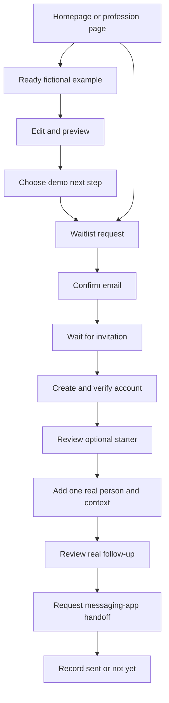

# Homepage and first-use experience roadmap

September 10, 2026 · Status: product implementation and technical qualification recorded; both requested copy sources are now supplied and indexed. Final copy acceptance, external human research, manual accessibility review, and post-launch evaluation remain open. See the [implementation acceptance record](HOMEPAGE_IMPLEMENTATION_ACCEPTANCE_2026-09-10.md).

Build **The Conversation Continues** as one connected experience: recognize a familiar situation, try a useful action, understand the access model, and return to that situation when invited. Prioritize a convincing, usable example before expanding motion production or acquisition campaigns.

This roadmap translates the [homepage blueprint](../assets/jump-in-the-mix-homepage-ui-ux-blueprint.md) and [five ICP profiles](../assets/README.md) into work packages and acceptance gates. Product behavior below was checked against repository source. Historical audit measurements are background, not measurements of the current build or evidence of conversion improvement.

## 1. Assessment and implementation decisions

The blueprint gives each chapter a useful job and makes participation the central proof. Its strongest elements are recognizable professional situations, editable contextual messages, deliberate next steps, honest invitation language, and continuity into onboarding. These address the profiles' common resistance to duplicate administration, generic outreach, and extensive setup.

Several decisions need to be made explicit for implementation:

| Finding | Decision and implication |
| --- | --- |
| The proposed hero is emotionally inviting but less literal than the current headline. | Keep the software category and concrete supporting sentence visible beside it. Test comprehension against the current headline before declaring the proposed wording better. |
| The homepage moves from business/personal/network positioning to independent professionals. | Adopt that acquisition focus. Keep personal and networking uses available in the product and help content; explain that the five examples illustrate uses rather than define eligibility. |
| A film, audience selector and demo could become three separate attention demands. | Use one selected situation across all three. The hero action moves directly to the ready demo; changing profession is optional. |
| The existing public demo prepares native-app handoffs and lets visitors enter contact details. | Replace its marketing experience with a fictional sandbox. Retain real handoffs in authenticated product workflows. Existing public-demo tests must change with this contract. |
| Some ICPs suggest adding five contacts for activation. | Follow the newer blueprint's one-person start. Offer additional people after the first useful action; never require five records. |
| Existing onboarding creates and assigns a starter campaign during submission. | Offer a reviewable starter and explicit choice before assignment. Do not convert demo completion into account enrollment or sending. |
| An invitation may arrive days later and on a different device. | Carry an optional, allowlisted scenario/template choice through the server-managed waitlist and invitation records. Browser storage alone cannot deliver this continuity. |
| The blueprint's receipt copy could expose whether an email already has an account. | Preserve the existing generic public receipt. Give more specific status only after a valid confirmation or authenticated access. |
| The existing event adapter has no collector and misses waitlist success. | Define actual success events and measurement policy early. Implement collection only with matching privacy disclosures and explicit cohort rules. |
| Cinematic presentation is a hypothesis. | Ship an excellent still-based experience first. Validate real estate and consulting; expand motion only when it adds value without hurting usability or load time. |

**Scope:** homepage, five profession pages, shared public navigation, waitlist and confirmation recovery, invitation/registration continuity, onboarding, the relevant starter Mixes, Today follow-up feedback, public help/trust content, metadata and measurement.

**Later work:** additional scenario films, genuine customer stories, further campaign experiments and broader educational content. This project does not require new AI generation, inbox synchronization, quoting, gallery management, applicant tracking, or paid-tier changes. References to planned features and pricing in the ICPs are hypotheses to reverify before using in copy.

## 2. Audience-to-experience map

Each profile is a fictional planning composite. Use its work problem, objection and proposed workflow; do not turn its biography, invented quotations, income or demographics into customer evidence or targeting requirements.

| Audience and route | Recognition and demo | Objection the experience should answer | Starter and first-use emphasis |
| --- | --- | --- | --- |
| Maya: `/for/real-estate-agents` | Chris requested a later text about a possible move. Default homepage example, clearly labeled. | Another CRM or robotic messages: show context, editing and a small start. | Reconnect at the agreed time; choose text deliberately and allow changed timing. |
| Daniel: `/for/consultants` | Revisit onboarding improvements after the client's hiring milestone. Use email. | Another administrative project or reputation risk: demonstrate one relevant reason to reconnect and reviewable text. | Keep the business milestone separate from private notes; confirm timing instead of applying a generic sales cadence. |
| Elena: `/for/photographers` | Pricing sent; clarify shorter coverage versus a full-day option. Initial channel: email, a creative hypothesis to test. | Another booking system or impersonal reminders: show a specific clarification while editing work continues. | Start with an unfinished inquiry. Do not imply social-inbox imports, gallery features, or assumptions about family milestones. |
| Marcus: `/for/painting-contractors` | An open estimate compares bedrooms with the full interior. Initial channel: text. | More evening administration or duplicate job software: demonstrate a short phone workflow. | Preserve scope and next timing. Show use while stationary; avoid generic repeat-repainting or automatic promotional sequences. |
| Lauren: `/for/independent-recruiters` | Candidate asked for later contact using personal email. | Duplicate ATS records or an inappropriate disclosure: show minimal private context, correct recipient channel and editable text. | Reconnect between searches. Do not infer an open role, ingest résumés, or promise LinkedIn/ATS synchronization. |

Use one reusable page composition with genuinely distinct situations, metadata, drafts, reassurance and starter mappings. Profession pages should arrive preselected and remain shareable without requiring a previous homepage visit. An alternative-audience link must always be available.

## 3. Page and journey specification

The real workflow must also support people whose next step is later. A saved future follow-up is useful setup progress; it is not a completed message or activated account under the measurement definition below.

| Surface | Required change | Visitor's next useful action |
| --- | --- | --- |
| `/` | Five chapters only: recognition, situation, demo, practical payoff, access. Compact header/footer; no repeated feature-card sections. | Try the preselected example or go directly to access. |
| Five `/for/...` pages | Same chapter structure with the correct scene, draft, objection and starter. Unique heading/title/description/canonical/share preview. | Try an immediately relevant example. |
| Header, footer and existing anchors | Examples, Sign in and direct waitlist navigation; compact profession grouping and trust links. Preserve or deliberately redirect existing `#sample`, `#features`, `#how-it-works`, `#questions`, `#your-data`, `#waitlist` targets. September 11: the questions section moved to a dedicated `/faq` page, so `#questions` and `#your-data` now resolve there and the homepage header and footer link to it. | Navigate without completing a tour. |
| Embedded access form and `/waitlist` | One shared form contract; visible label, preserved input, pending/error/retry/receipt states and current admission policy. | Request confirmation or recover from a failed request. |
| `/waitlist/confirm`, `/waitlist/leave` | Explicit confirmation action; clear used/expired-link recovery; preserve leave and suppression behavior. | Confirm, request another confirmation, or leave. |
| Confirmation and invitation emails | Match the public promise, timing and access status; preserve relevant starter choice through the underlying record. | Confirm email, then redeem an actual invitation when issued. |
| `/register`, `/verify-email/pending`, verification handler, `/login` | Carry starter context through supported account flows, verification and recovery. Handle paused/invalid/used invitations and existing accounts accurately. | Enter the correct account flow without losing the optional choice. |
| `/onboarding` | Lead with one person and their context. Defer nonessential business setup, imports and provider connections. Review starter before explicit use. | Prepare one useful follow-up. |
| `/templates`, template-use screen and `/jumps` | Show the selected starter as a suggestion, retain change/skip options, emphasize the chosen person's next action and honest outcome recording. | Act, leave it pending, or reschedule; then optionally add another person. |
| `/help`, `/privacy`, `/terms`, `/contact` | Consistent access, sending, small-start and data explanations; update privacy if collection changes. Keep support reachable from failure states. | Resolve an objection or get help. |
| Sitemap, robots and social previews | Add the five public routes to the allowed indexable set. Retain private-test/pilot indexing protection and token-page exclusions. | Land on a complete, relevant page from search or a shared link. |

### Homepage content and interaction contract

- Use the blueprint's five chapter questions and draft copy as the initial content hypothesis. Target 250–350 visible marketing words on a default path; record counting exclusions for editable messages and expanded questions. Access, cost and material data information take priority over that target.
- The hero identifies follow-up software without film playback. Its primary button is **Try the demo**; **Join the waitlist** stays directly available. Completion and access buttons can use **Join the free-account waitlist**.
- Keep all five audience labels discoverable on phones. Default to real estate on `/`; a profession route preselects its own scenario. Do not infer profession from visitor behavior or device information.
- Implement `ready → preview → next step → complete`. Each state has one primary action. Back preserves edits; Reset restores the active scenario. Selecting another example retains each example's state in memory while the page remains open. Reload resets drafts; make this behavior clear.
- Next step offers a review date or leaving it for now. The latter gets accurate completion text, such as “Left for now,” rather than claiming that a date was set. No reply, booking, delivered message or account schedule is simulated as real.
- Use fixed fictional identity/context and an editable message. Do not collect recipient details in the sandbox. Keep drafts in memory, outside URLs, persistent storage, telemetry and access requests. Demo actions never invoke `sms:`, `mailto:`, `tel:` or messaging/account mutation endpoints.
- Keep the chosen context label as ordinary HTML. Transitions enhance an immediately understandable change; normal scrolling, selection and completion work without animation.
- Introduce “A Mix is a follow-up plan you can reuse” after demonstrating value. Avoid adding a musical vocabulary lesson to the path.

## 4. Copywriting and reference workflow

The two requested Joanna Wiebe references were absent during planning and supplied later on September 10. Both are now reviewed and linked in [the reference index](../assets/README.md). The [copy matrix reconciliation](HOMEPAGE_COPY_AND_CLAIM_MATRIX_2026-09-10.md#supplied-source-reconciliation) maps their guidance to the current implementation and identifies remaining copy review and validation work. Source availability is resolved; it does not establish customer comprehension or conversion improvement.

The original interim references remain background: Joanna Wiebe's [headline criteria](https://copyhackers.com/2013/09/writing-powerful-headlines/) and [SweatBlock copywriting analysis](https://copyhackers.com/2016/06/copywriting-principles-sweatblock/). The supplied local guides now govern the project's reference workflow; none of these sources' reported results predict Jump in the Mix results.

For every page or campaign:

1. Identify the intended audience, entry promise, immediate problem, desired action and chief objection. Use behavioral fit rather than fictional personal characteristics.
2. Collect actual prospect wording when research becomes available. Record source, date and permission for public quotation; keep invented persona language labeled as a hypothesis.
3. Build the message sequence: recognizable situation → useful possibility → observable demonstration → access request and reassurance. Give every section a distinct purpose.
4. Link every product, access, cost or data claim to current behavior or an accountable source. Distinguish implemented, proposed and customer-validated claims. Preserve review control and the actual optional-sending exceptions.
5. Review headings, button labels, errors, emails, metadata and onboarding together for promise continuity. Show the action that really happens next; a request is not confirmation or an account.
6. Check for unsupported integrations, automatic outreach, invented proof, urgency, guaranteed earnings or time savings. Keep literal enough language to explain the product even with images removed.
7. Record the hypothesis, comprehension evidence and measurement decision. Update copy from observed confusion and behavior; brevity alone is not a success criterion.

**Required content artifact in Phase 0:** a copy matrix with route/state, draft, audience/source, claim evidence, objection answered and review status. This becomes the reusable reference for future marketing work alongside the original source files.

## 5. Implementation architecture and boundaries

| Existing code | Planned implementation |
| --- | --- |
| `src/app/page.tsx`, `src/styles/homepage.css` | Compose the five chapters from shared public components. Scope the new palette and typography to public surfaces first; avoid changing authenticated screens through broad global selectors. |
| No existing profession route | Add `src/app/for/[profession]/page.tsx` with five allowlisted slugs and a shared page renderer. Unknown slugs return 404. Use server-rendered selected content for direct visits and no-JavaScript reading. |
| `src/components/ProductDemo.tsx`, `src/lib/product-demo.ts` | Introduce a separate marketing sandbox and typed scenario manifest, for example `src/components/marketing/` and `src/lib/marketing-scenarios.ts`. Reuse useful UI primitives without importing native handoff or account-writing behavior into the sandbox. |
| `WaitlistForm.tsx`, `waitlist-actions.ts`, waitlist pages | Keep existing waitlist services; enhance form state and server-backed recovery. Render a functional plain form through a Server Component path when JavaScript is absent. Preserve pending protection, abuse controls and explicit confirmation. |
| `waitlist.ts`, invitation/auth services, `prisma/schema.prisma` | Add nullable, versioned scenario/template context to the appropriate durable records. Map it through confirmation, invitation redemption and account verification, including delayed and cross-device visits. Use an additive migration and safe defaults for existing records. |
| `OnboardingForm.tsx`, `onboarding-actions.ts`, `starter-mix.ts`, `vertical-plan-library.ts`, `business-taxonomy.ts` | Map marketing scenarios to explicitly reviewed starter definitions. Broad existing business categories do not identify all five professions. Keep scenario identity separate from those categories; do not silently choose an unrelated generic plan. |
| `JumpWorkflow.tsx`, `opened-jump-state.ts`, `jump-status-actions.ts` | Preserve the distinction between a requested handoff and user-recorded outcome. Opening a link cannot verify OS app launch, sending or delivery. Offer “Not yet” without completing the follow-up. |
| `PublicConversionEvents.tsx`, `docs/HOMEPAGE_CONVERSION_EVENTS.md` | Version and extend the event contract to landing/demo/access and real success boundaries. Current hooks operate only on `/` and `/register`; waitlist clicks alone cannot establish success. |
| `public-trust.ts`, `sitemap.ts`, `robots.ts`, page metadata | Extend the public route list while retaining environment guards. Keep scenario query variants canonicalized to the clean route and never expose invitation tokens in previews or analytics. |

Consult the installed Next.js guides before writing implementation code: layouts/pages, Server and Client Components, mutating data, videos, images and metadata under `node_modules/next/dist/docs/`. The inspected package is Next.js 16.3.4; use its documented conventions, including asynchronous route parameters, rather than remembered older APIs.

### Access and persistence decisions

- Carry only `scenarioId`, `scenarioVersion` and an approved `starterTemplateId` as functional preferences. Validate at every server boundary; unknown or retired values fall back to a neutral starter choice.
- A homepage selector can pass an allowlisted choice to `/waitlist`; draft edits and fictional contact data never follow it. Direct waitlist, member invitation and returning-user paths work with no scenario context.
- Store the choice with a new waitlist request and preserve it through confirmation. Do not let an unauthenticated duplicate submission overwrite an already-confirmed person's preference. Allow changes after ownership is verified.
- Keep email confirmation tokens and invitation tokens separate from scenario context. Preserve token expiry, one-use behavior, capacity pauses, waitlist ordering, email suppression and legacy invitations.
- The form may show the address the visitor just entered locally. It must not publicly reveal whether that address belongs to an existing account or confirmed request. A generic receipt must also cover duplicate and email-quota cases.
- A resend control must use real server rate limits, including any daily cap; a cosmetic countdown does not create permission to send. Do not promise a fresh email when the service suppressed or deferred it.
- Keep selection retention and deletion documented with the waitlist/account lifecycle. Functional preferences do not imply consent for cross-page marketing attribution.

## 6. Delivery sequence and completion gates

All phases began **not started** at planning. The checkboxes and acceptance record now distinguish implementation from remaining human validation. Owners are roles to assign, not assumptions about available staff. Schedule each phase after its predecessor's evidence is available; media rights, research recruitment and invitation delays make fixed delivery dates premature.

| Phase | Accountable role | Dependency | Reviewable result |
| --- | --- | --- | --- |
| P0 — Evidence and copy contract | Product/content owner | This roadmap | Reference reconciliation, copy/claim matrix, route/state inventory and current baseline. |
| P1 — First useful prototype | Product designer with frontend owner | P0 | Real-estate story-to-demo prototype, consulting variant and observed comprehension results. |
| P2 — Shared public experience | Frontend owner with content owner | P1 | Homepage plus all five profession routes with still media, working sandbox and access navigation. |
| P3 — Access and measurement foundations | Full-stack owner | P0 contracts; P2 integration surface | Reliable waitlist recovery, durable scenario continuity and verified event boundaries. |
| P4 — Invitation to first real action | Product/full-stack owner | P3; reviewed starter mappings | Starter review, one-person onboarding and truthful follow-up outcome recording. |
| P5 — Qualification and release | QA/release owner with design/content owner | P2–P4 | Accepted public and account journey, media fallback, release evidence and rollback procedure. |
| P6 — Evaluate and expand | Product/research owner | P5 and observed cohorts | Documented outcome assessment and decisions on wording, motion and profession investment. |

P3 contract/schema design can run alongside P1/P2 work once P0 decisions are settled. Motion sourcing can proceed after P1; its delivery must not delay a usable still-based release. This sequence is a delivery plan, not authorization to publish or contact research participants during this planning task.

### P0 — Evidence and copy contract

- [x] **P0.1** Index all five ICPs and the blueprint; locate/read the two requested Joanna files or record the owner's resolution of that source gap. Preserve the originals. Both files supplied and reviewed September 10; see the reference index and copy matrix reconciliation.
- [x] **P0.2** Complete the copy/claim matrix for six landing pages, form states, emails and first use. Identify which claims are hypotheses and which are supported by code.
- [ ] **P0.3** Approve scenario-to-template mappings, the generic receipt behavior, draft-reset behavior and functional-context retention. Record where existing starter content requires revision.
- [x] **P0.4** Capture a fresh production-build baseline for layout, page weight, media requests and the current demo/access path. Label historical measurements separately; document that current conversion hooks have no collector.
- [ ] **P0.5** Assign phase owners and define measurement eligibility, observation windows and research recruitment criteria before collecting data.

**Exit evidence:** linked source register, reviewed matrix, baseline report and decision log. Missing source files are an explicit content dependency rather than assumed reviewed material.

### P1 — First useful prototype

- [x] **P1.1** Demonstrate all four sandbox states, edit/back/reset, both next-step choices and direct access navigation at phone and desktop sizes using the real-estate scenario.
- [x] **P1.2** Change to consulting without rebuilding the interface. Check that the channel, context, draft and closing scene all change together.
- [ ] **P1.3** Test with five behaviorally suitable agents and five consultants. In each group, at least four of five explain that it is follow-up software, finish the sandbox without coaching within two minutes, and describe confirmation followed by invitation. All participants must understand that no real message was sent; any sending misconception triggers a copy/interaction revision and another check.
- [ ] **P1.4** At least four of five in each group can describe one appropriate real situation they would use it for. Record objections and current workarounds; do not treat stated enthusiasm as demand.
- [ ] **P1.5** Test the blueprint headline with its category/subhead and compare comprehension with the existing direct headline. Record the reason for the selected wording.

Preparation for P1.5: the [headline review](HOMEPAGE_HEADLINE_REVIEW_2026-09-10.md) contains 25 scored candidates and a three-hypothesis comparison brief. This prepares the sessions; it does not close the participant gate.

**Exit evidence:** interactive prototype, consented/anonymized research notes, counts and resolved issues. These small-sample thresholds are proposed usability gates, not statistical conversion evidence.

### P2 — Shared public experience

- [x] **P2.1** `/` and all five profession URLs work on direct load, refresh and browser navigation; unknown profession slugs return 404. Each profession route renders the correct example before hydration.
- [x] **P2.2** Five chapters, the counting convention, compact navigation and all direct waitlist paths pass content review. Every route has distinct, accurate metadata and a working share image.
- [x] **P2.3** Each scenario passes ready/preview/next-step/complete, back/reset/switching and date/leave-for-now checks. A stale example date never appears to be a real scheduled commitment.
- [x] **P2.4** Network and link inspection show zero real-send/account mutations from sandbox actions, zero native messaging links in the sandbox, and no draft or fictional contact fields in telemetry or access submissions.
- [x] **P2.5** With JavaScript disabled or hydration failing, visitors can read the proposition and a static example, navigate to profession pages and submit through the server-backed access path. Show a clear static-demo fallback when interaction is unavailable.
- [x] **P2.6** Existing useful anchors, sign-in and trust links still resolve; selecting an audience does not move the page unexpectedly or erase another example's current in-memory edits.

**Exit evidence:** six-route browser results, captured sandbox requests, no-JavaScript submission fixture and content/metadata review.

### P3 — Access and measurement foundations

- [x] **P3.1** Validate empty/invalid email, pending submit, temporary failure, retry, generic receipt, change-email and resend states. Preserve typed email on recoverable errors without placing it in a URL.
- [x] **P3.2** Test duplicate/unconfirmed/confirmed/invited/existing-account submissions, used/expired confirmation links, rate limits, collection and redemption pauses, capacity constraints and leave/suppression behavior. Existing status is not leaked through public receipts.
- [x] **P3.3** A confirmation link view alone cannot confirm an address. A successful explicit confirmation is counted once; replay cannot create another conversion or alter queue position.
- [x] **P3.4** An allowlisted scenario survives waitlist submission, confirmation and delayed invitation on a fresh browser context. Old records, absent context, tampered values, retired templates and repeat requests have tested fallbacks.
- [x] **P3.5** Event tests distinguish request accepted, confirmation email accepted by the provider, email confirmed, invitation issued and account created. Generic public receipts and button clicks are not used as server success evidence.
- [x] **P3.6** If a collector is enabled, its allowlist, consent/privacy-signal behavior, retention, deletion and deduplication pass review and payload inspection. Otherwise report collection as unavailable and retain only the bounded event contract; do not claim funnel rates.

**Exit evidence:** isolated-database integration results, recovery-state screenshots, delayed/cross-device fixture, event examples and migration/rollback notes. Use captured/test mail; no unsolicited real messages during verification.

### P4 — Invitation to first real action

- [x] **P4.1** Valid waitlist and member invitations reach the correct account/verification flow. Existing accounts, invalid/used links and paused redemption have accurate recovery; none bypass invitation admission.
- [x] **P4.2** New accounts see the relevant editable starter with clear use/change/skip choices. No fictional person or edited sandbox message is copied into the account. Existing users' plans remain intact.
- [x] **P4.3** A user can prepare a follow-up with one name, appropriate contact method, relevant private context and agreed timing. Business profile completion, larger imports, provider connection and referrals are optional later steps. Timezone and necessary sending details remain accurate.
- [x] **P4.4** Explicitly using a starter creates only the reviewed assignment and follow-up schedule, once. Skip/change/retry and missing-template paths cannot silently enroll a campaign or create duplicate contacts/assignments.
- [x] **P4.5** Today shows the chosen person's context and reviewable draft. A handoff request stays pending until the user records an outcome; “Not yet” preserves the task. User-confirmed sending is distinct from provider acceptance, delivery and reply.
- [ ] **P4.6** In each of the two initial research groups, at least four of five invited participants can prepare the first real follow-up without coaching. Test sent/not-yet behavior with controlled recipients; measure actual customer follow-through separately and allow legitimately later timing.
- [x] **P4.7** After completing the first real action, users can add another person or return to their work. Defer the System Mix invitation prompt until it does not compete with the first useful task; retain the feature elsewhere.

**Exit evidence:** invitation-to-Today recordings using test accounts, starter/state assertions, one-person usability notes and honest outcome events.

### P5 — Qualification and release

- [x] **P5.1** Test six landing pages plus access and first-use states at 320, 390, 768 and 1440 CSS pixels, with 200% zoom/reflow checks and supported light/dark modes. No clipped controls, horizontal page overflow or obscured focused fields.
- [ ] **P5.2** Keyboard and screen-reader checks cover selection, editor, preview, dates, form errors and recovery. Focus order is stable; meaningful state changes are announced. Automated accessibility scans have no serious/critical violations, and manual review resolves remaining relevant issues. Validate actual contrast; target 44px touch areas. Automated keyboard, focus-order, announcement, target-size and open-picker scan coverage for the follow-up date picker and the demo handoff row was recorded September 11 in the acceptance record; the manual screen-reader session remains open.
- [x] **P5.3** Reduced motion, failed media, slow network, hidden tab and offscreen playback work. At most one clip plays; controls are discoverable; no autoplay sound. Core copy and action remain usable with every clip blocked.
- [x] **P5.4** For three repeatable mobile lab runs per landing route, meet proposed targets: median LCP ≤2.5s, CLS ≤0.1, and Lighthouse performance ≥90. Record environment and request sizes; test interaction responsiveness in browser traces. These are project release targets, not field measurements. Inactive scenario videos must not download on initial load.
- [x] **P5.5** All shipped media has an asset manifest covering rights/releases, scenario, alt/text treatment, desktop/mobile crop, dimensions and compressed size. The initial release can use stills throughout; any real-estate/consulting clips must have equivalent posters and closing stills. Preserve the logo and test the proposed palette.
- [x] **P5.6** Production build, type checks, applicable unit/integration tests and browser journeys pass. Update existing tests that assume 13 public-demo handoffs; retain meaningful authenticated handoff and privacy coverage.
- [ ] **P5.7** Content, current invitation policy, optional sending distinctions, trust pages, indexing guards and privacy disclosures match the release. Claims have evidence; illustrative scenes are not testimonials.
- [x] **P5.8** Preview review and release checks use the deployed build. Record a rollback procedure to the prior public experience; disable new media/collection independently if needed and preserve existing waitlist/invitation data through additive-schema rollback.

**Exit evidence:** acceptance matrix with links to tests, screenshots, lab runs, manual device checks, copy review and release/rollback receipt. A launch is complete only when P0–P5 gates are accepted; unresolved material failures remain open.

### P6 — Evaluate and expand

- [ ] **P6.1** Evaluate comprehension and friction for the other three profession pages with at least five suitable participants per profession, using the P1 task criteria. Treat unfamiliar context, channel mismatch and duplicate-entry objections as revision inputs before dedicated campaign expansion.
- [ ] **P6.2** Observe mature acquisition and invited-account cohorts using the definitions below. Publish denominators, missing attribution, exclusions and uncertainty with the results.
- [ ] **P6.3** Compare still versus motion with copy and interaction held constant. Use randomized traffic only when volume supports a preplanned sample; otherwise use task observation and label conversion results inconclusive.
- [ ] **P6.4** Compare return use across busy weeks, completed appropriate follow-ups and reported maintenance effort. Do not manufacture tasks to increase activity counts.
- [ ] **P6.5** Record a keep/change/stop decision for headline, motion and each audience. Produce the remaining clips or a customer story only where the evidence justifies it and appropriate permissions exist.

**Exit evidence:** a dated learning report and prioritized follow-up backlog. Completion means the experiment was evaluated honestly; it does not require or imply a conversion lift.

## 7. Measurement definitions and decisions

The current privacy page says the app does not send usage events to an analytics provider. The current event adapter dispatches local browser events only. A new collection system is separate implementation work, with corresponding privacy updates before activation.

| Signal | Truthful trigger and denominator |
| --- | --- |
| `landing_view`, `scene_selected` | Eligible landing session and deliberate scenario selection. Default rendering is not a visitor choice. |
| `demo_started` | First intentional sandbox action; count once per session and scenario version. A scroll or film view is not a start. |
| `demo_completed` | Successful save of a demo next-step choice, including leave-for-now with a separate choice value. Completion rate = unique completed demo sessions / unique started demo sessions in the same scenario/version cohort. |
| `waitlist_request_accepted` | Server records a qualifying request. Distinguish new request, re-entry and duplicate suppression internally; expose no account status to public clients. |
| `confirmation_email_accepted` | Email provider accepts the confirmation message. Not inbox delivery, email confirmation or account creation. |
| `waitlist_confirmed` | Successful confirmation transition, deduplicated by the underlying record/version. Confirmed-waitlist rate = new confirmed signups attributed within 7 days / eligible landing sessions in the same entry cohort. Report re-entries separately. |
| `invitation_issued`, `account_created`, `account_verified` | Respective committed server transitions. Count invitation acceptance separately from waitlist confirmation, and keep account creation distinct from email verification. |
| `first_follow_up_prepared` | First real contact/context and reviewed follow-up persisted. Setup success only. |
| `real_handoff_requested` | User requests opening their messaging app; OS opening and sending cannot be assumed from this event. |
| `first_real_follow_up_completed` | First real follow-up explicitly recorded as sent/call completed, or a separately labeled supported provider outcome. For the primary manual cohort, activation = invited accounts recording one real completed follow-up within 14 days of creation / invited accounts created in the same cohort. Replies, delivery and scheduled tasks are different measures. |
| Meaningful return | Activated accounts completing another appropriate real follow-up on a different day within 28 days / activated accounts with a full 28-day observation window. Track voluntary return and upkeep objections alongside this rate. |

The 7/14/28-day windows are proposed starting definitions to settle in P0. Analyze by selected profession, entry route, device category and creative version. Separate waitlist versus member invitations, exclude staff/bots/test accounts and duplicate events, and report invitation-capacity pauses as context rather than a landing-page failure.

Allowlist event names, route identifiers, scenario/template/version, state, coarse device and controlled outcome codes. Do not collect drafts, names, emails, phone numbers, private notes, raw URLs/referrers/query strings, or access tokens. Preserve existing Do Not Track and Global Privacy Control suppression. Define consent, event retention and deletion explicitly for the chosen collection approach.

If lawful, disclosed cross-page attribution is enabled, use a first-party opaque identifier and a documented association at the server success boundary. Functional starter continuity must work without it. Where attribution is unavailable, report unlinked counts and coverage; do not divide unrelated confirmation totals by landing sessions or invent a connected funnel.

Before a live comparison, record the baseline, minimum worthwhile effect, sample-size assumptions, allocation and stopping rule. With insufficient traffic, report uncertainty and continue qualitative validation; do not choose an arbitrary conversion percentage as a release gate. Keep film completion and scroll depth diagnostic.

## 8. Verification work and roadmap completion

Relevant existing coverage includes `tests/product-demo.test.ts`, `tests/waitlist-actions.test.ts`, `tests/waitlist-mail.test.ts`, `tests/waitlist.integration.test.ts`, `tests/public-trust.test.ts`, `tests/vertical-plan-library.test.ts`, and the `e2e/product-demo`, `homepage-conversion`, `waitlist`, `registration`, `customer-journey`, `public-trust`, `browser-privacy` and `accessibility` suites.

For implementation, run `npm run typecheck`, the applicable unit/integration tests, `npm run build`, and targeted Playwright journeys with an isolated seeded database and captured mail. Add meaningful coverage for new sandbox state transitions, persistence, no-JavaScript requests and actual conversion boundaries. Do not treat skipped database suites as passes. Extend the current one-run homepage/login Lighthouse configuration for the six-route, three-run release matrix above.

Planning verification on September 10, 2026: the five selected existing unit-test files (`product-demo`, `waitlist-actions`, `waitlist-mail`, `public-trust`, `vertical-plan-library`) passed, totaling 46 tests. All 22 local document links resolved and the roadmap contains 42 unique completion-criterion IDs across seven phases. These checks validate the planning references and relevant existing behavior; redesigned browser flows, database migrations and conversion outcomes remain future acceptance work.

**Planning deliverable is complete when:** the source-based assessment, six-route plan, downstream page changes, dependencies, owners, measurable phase exits, measurement definitions and outstanding source gap are documented and linked for future work. **Implementation is complete when:** P0–P5 evidence is accepted. **Evaluation is complete when:** P6 records observed results and decisions. None of these definitions permits claiming that the redesign is already built or that it has improved conversion.

### References

- [Source asset register and future-use guidance](../assets/README.md), including all five fictional ICPs.
- [Homepage blueprint](../assets/jump-in-the-mix-homepage-ui-ux-blueprint.md), the primary creative and interaction proposal.
- [Conversion copy decisions](CONVERSION_COPY.md), [current event contract](HOMEPAGE_CONVERSION_EVENTS.md), [homepage refinement history](HOMEPAGE_REFINEMENT_2026-09-07.md), [customer journey plan](CUSTOMER_JOURNEY_IMPLEMENTATION_PLAN_2026-09-05.md) and [quality gates](PRODUCT_QUALITY_GATES.md).
- [W3C guidance on pausing moving content](https://www.w3.org/WAI/WCAG22/Understanding/pause-stop-hide.html): provide a way to control qualifying automatically moving content; this roadmap requires controls for its clips.
- [web.dev video loading guidance](https://web.dev/articles/lazy-loading-video): prioritize a relevant hero poster and defer video loading where appropriate. The project's exact loading/performance targets are proposed acceptance criteria.
